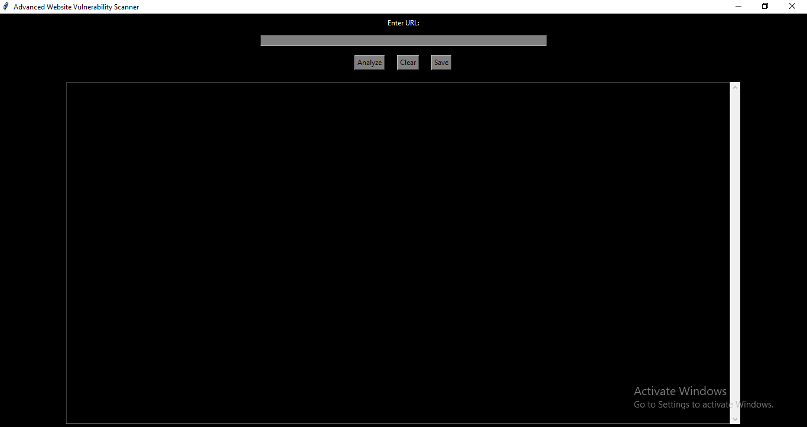
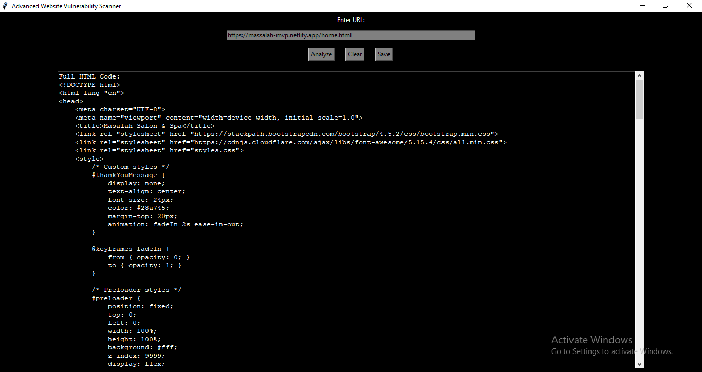

# 🌐 Advanced Website Vulnerability Scanner

 <!-- Replace with the path to your GUI image -->

## 🚀 About the Project

The **Advanced Website Vulnerability Scanner** is a comprehensive tool that allows users to analyze websites for potential vulnerabilities. It provides insights into website security by:
- Testing for **SQL Injection** and **Cross-Site Scripting (XSS)** vulnerabilities.
- Fetching and displaying full **HTML** and **JavaScript** code.
- Checking URLs against **VirusTotal** for threat detection.

Designed with a modern and aesthetic **Tkinter GUI**, this tool is user-friendly and accessible to security enthusiasts and professionals.

---

## 🎯 Features

1. **Vulnerability Scanning**: Detect potential SQL Injection and XSS vulnerabilities.
2. **Code Analysis**: View and analyze full HTML and JavaScript of the target website.
3. **VirusTotal Integration**: Check URLs against the VirusTotal API for a detailed threat analysis.
4. **Result Management**: Save scan results locally for further review.
5. **Clear and Intuitive UI**: A sleek, responsive interface for effortless navigation.

---

## 💻 How It Works

1. Enter the URL you want to analyze.
2. Click the **Analyze** button to begin scanning.
3. View results in the scrollable text area, including:
   - Detected vulnerabilities.
   - Threat details from VirusTotal.
   - Full HTML and JavaScript code.

4. Save results to a text file or clear the interface for a new scan.

---

## 📸 Screenshots

### 1️⃣ **Graphical User Interface (GUI)**
 <!-- Replace with the path to your GUI image -->

### 2️⃣ **Output Results**
 <!-- Replace with the path to your results image -->

---

## 🛠️ Installation

1. Clone the repository:
   ```bash
   git clone https://github.com/Illusivehacks/Link-vulnaribility-scanner-.git
2. Navigate to the project directory:
    bash
    ```cd ```
3. Install the required dependencies:
    bash
   ```pip install -r requirements.txt```
4.Run the application:
    bash
    ```python bestversion.py```


🔑 Configuration
Replace the default VirusTotal API key in the code with your own:
python
```DEFAULT_API_KEY = "your_virustotal_api_key"```

⚙️ Requirements
Python 3.8 or later
Required Python libraries: requests, beautifulsoup4, tkinter

🛡️ Disclaimer
This tool is designed for educational and ethical hacking purposes only. Always obtain proper authorization before testing the security of any website.

🤝 Contributing
Contributions are welcome! Feel free to: Mpesa express- 07438444

Submit issues.
Fork the repository and create pull requests.
Suggest new features or improvements.

📄 License
This project is licensed under the MIT License. See the LICENSE file for more details.

📧 Contact
For questions or support, reach out to williamkitungo@gmail.com

vbnet
```Let me know if you need further adjustments or additions to the README!```


